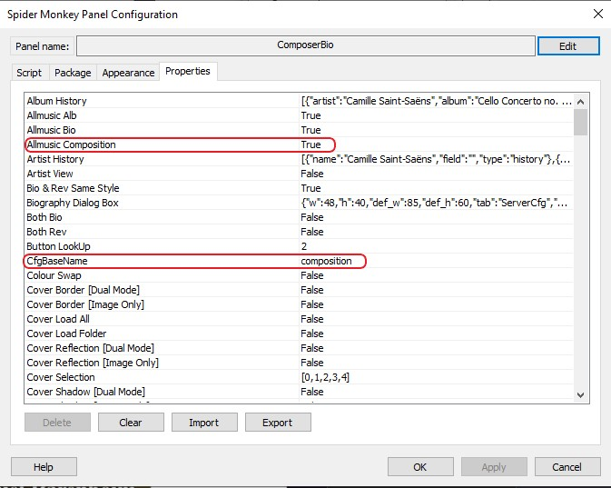

# WilB's Biography SMP Panel Mod
This is a simple mod based on [WilB's Biography SMP Panel](https://hydrogenaud.io/index.php?topic=112913) for Foobar2000.

Mainly this mod was necessary to properly display classical music information in Foobar2000. This mod leverages the builtin support for Allmusic in WilB's panel to fetch & display relevant information. Note that this is only supported for Allmusic as Last.fm does not contain composition data. The modifications are described in more detail below.

* Current Version: [Biography v1.2.0](https://hydrogenaud.io/index.php?action=dlattach;topic=112913.0;attach=20718)

* Modifications:
    * Allows for multiple server instances per panel. This is done by making each server have a configuration per panel. The default naming is `biography`. This can be changed in the `Panel Properties` by the `CfgBaseName` property.
    * Ability to override the `Allmusic Review` feature to fetch `Allmusic Composition`. This change the search parameters from `album` to `compositions`. This mode can be enabled by setting the `Allmusic Composition` property in the `Panel Properties` to `True`. With mode enabled the `%BIO_ALBUM%` is used for the composition search.

## Screenshots

